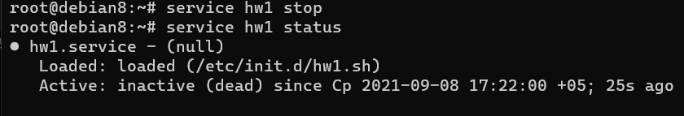
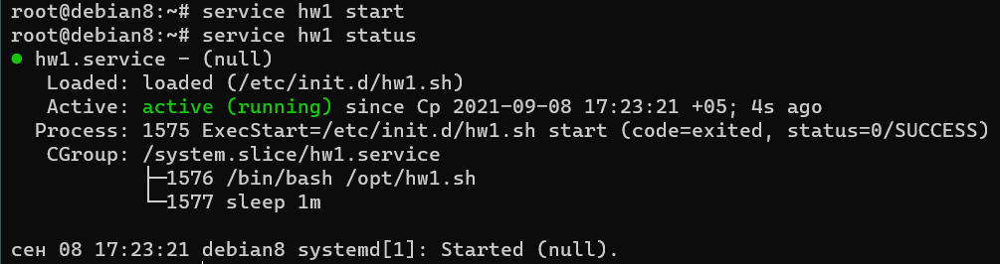
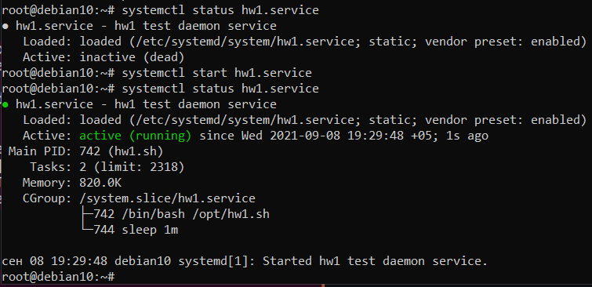
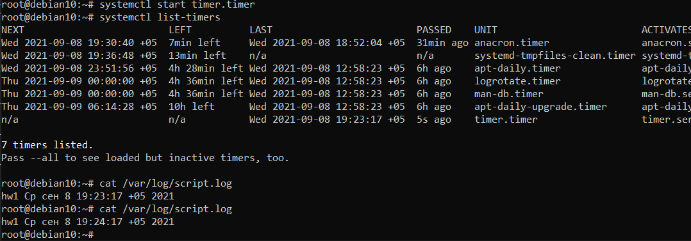

# Теория:
## 1. Назовите основные отличия и преимущества systemd от sysvinit, опишите подходы.
 - sysvinit запускает процессы последовательно исходя из фазы загрузки (runlevel)
 - systemd сначала исполняет default.target, а затем строит дерево зависимостей
 - systemd поддерживает активацию сервисов на основе сокетов, а также создаёт сокеты отдельно от запуска демонов
## 2. Каким образом происходит параллельный запуск всех процессов но в то же время сервисы стартуют с нужными зависимостями друг относительно друга
  - systemd позволяет заранее создать сокет для сервиса
  - systemd строит дерево зависимостей, по которому определяет порядок запуска
## 3. каким образом проверить работает процесс в sysvinit и в systemd?
- sysvinit:
  - 1 вариант 
    ```bash
    chkconfig <service>
    ```
  - 2 вариант
    ```bash
    service --status-all
    ```
- systemd:
  ```bash
  systemctl status unit
  ```
## 4. Как добавить в автозагрузку init скрипт в sysvinit и в systemd?
 - sysvinit: добавить скрипт в директорию /etc/init.d и выполнить команду 
    ```bash
    chkconfig <service> on
    ```
 - systemd: добавить файл с описанием в /etc/systemd/system и выполнить команду
    ```bash
    systemctl enable <service>
    ```
## 5. Как посмотреть логи в системе systemd по нужному нам процесс
  ```bash
  journalctl -u <service>
  ```

# Практика:
## 1. написать простой скрипт на любом языке программирования который будет работать в режиме демона
[/opt/hw1.sh](opt_hw1.sh)

## 2. установить дистрибутив Debian 8 и написать sysvnit скрипт для запуска процесса, добавить в автозагрузку, проверить автозагрузку и работу start stop аргументов
[/etc/init.d/hw1.sh](etc_initd_hw1.sh)

```bash
update-rc.d hw1.sh start
```





## 3. Установить Debian 10, написать systemd unit, ш в автозагрузку, проверить что скрипт запускается после рестарта, проверить start stop status unit-а
[/etc/systemd/system/hw1.service](hw1.service)

```bash
chmod 644 /etc/systemd/system/hw1.service
systemctl daemon-reload
systemctl enable hw1.service
```



## 4. написать timer для systemd который раз в 5 минут пишет что-либо в лог файл

[/etc/systemd/system/timer.timer](timer.timer)

[/etc/systemd/system/timer.service](timer.service)

